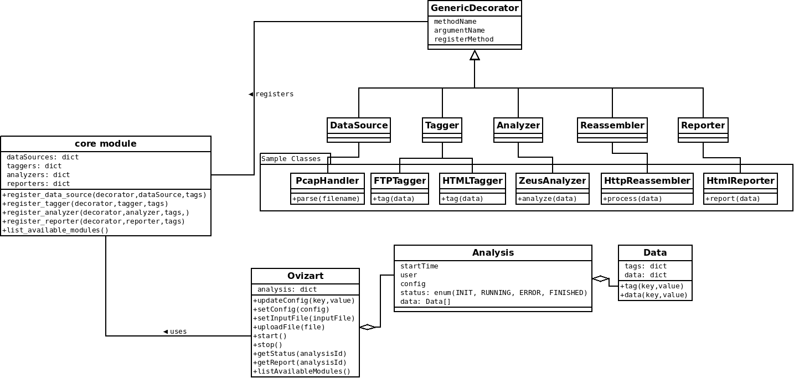

.. _structure:

****************
System Structure
****************

.. _overview:

Overview
========

This page will explain the basics of the projects design.

Before starting to explain the classes here is the UML of the design summary:

.. _modules:

Classes
-------
* **Data**: Data class will contain 2 only dictionary, with names: data and tags. While the data dictionary holds the
  basic data provided by data source(namely pcap files, hpfeeds data or netflow data), tags contains the meta-data or
  information extracted/calculated by using/analyzing the data. From now on all information generated by system
  components/modules will be named as tags.

* **Analysis**: This represents an analysis process. All the collected/calculated data will store is this class in
  order to organize/store the data and provide history capability to ovizart. System may run multiple analysis'
  parallel in async manner.

* **Ovizart**: This class provides an interface for the User Interfaces, which are defined as CLI and Web. This class
  works as a mediator to organize the system calls and query the module availability, analysis state or update config
  parameters as well.

Workflow
--------
The workflow of core system can be summarized like this;

#. Parse pcap, extract streams. Streams are packet groups based on 5 tuple(proto, srcIP, srcPort, dstIP, dstPort) where
   port info applicable, otherwise we use 3 tuple to identify connections. Separate pcap files per stream are created
   during this step. Also ip fragmentation is handled at this step.

#. Tag the separate traffic data. Each stream's pcap file is parsed at this procedure to detect application layer protocol.
   This module is currently depends on payload signatures. Supported protocols are: HTTP, HTTPS, SMTP, FTP, SSH, SOCKSv4.
   Found application layer protocols are added to streams as tag elements.

#. After tagging with protocol information each flow processed by this module to extract application layer traffic in a
   more analyze/user friendly format. Our system also support to add protocol specific reassemblers. Currently our system
   support HTTP and SMTP, that means we are able to extract transferred files over these protocol. After this process 3
   files generated for each stream. request.traffic, response.traffic, total.traffic. First 2 files contain unidirectional
   traffic where the last one contain bidirectional traffic.

#. This step belongs to analyzer module. Based on the tag values, streams are analyzed by appropriate analyzers. For example
   virus total analyzers support only binary file. Any stream has binary attachment will be processed by that particular
   analyzer. During this process a stream maybe analyzed by more than one analyzer. After analyzers completed their job,
   analyzers should tag the streams about the results.

#. For the last step reporter modules process and format the calculated or measured stream values.

Modules
=======

Ovizart is basically composed of 5 modules; Data Source, Tagger, Reassembler, Analyzer and Reporter. Each module is
separated from each other in order to provide modularity. They will not communicate with each other directly. Each
module completes its job and add new tags to data they process. if necessary. System will forward processed data to
next module. So it is quite easy to add new modules or new classes to existing modules. Ovizart has a transparent
evaluation engine which will hide the integration details from developers by using decorators. Thanks to decorators
during start-up all decorated classes will be, first checked whether they are valid or not, then instantiated an object
and register it to system. All of the modules has its own decorators.

It would be nice to check the decorator structure before we move in other modules.

.. _decorators:

Decorators
----------
Rather than using inheritance we choose to use class decorators to provide extensibility. This approach is quite easy to use and hides the integration details. Here is an example for an awesome IRC analyzer;

.. sourcecode:: python

    from ovizart import Analyzer
    from ovizart import Tags

    # TODO: Revise this part. too long to use
    IRC = Tags.Protocol.IRC

    # For tags, one may use array as well, both of them accepted.
    @Analyzer(tags=IRC)
    class MyAwesomeIRCAnalyzer:
        """Here is the awesome description of awesome irc analyzer..."""

        def __init__(self):
            print "I'm awesome"

        def __repr__(self):
            return "MyAwesomeIRCAnalyzer"

        def analyze(self, data):
            # Do some awesome stuff here
            pass

Let's examine the code,::

    @Analyzer(tags=IRC)

The decorator expression registers MyAwesomeIRCAnalyzer to ovizart's core system. One of the important detail is the tags parameter. This parameter may be a single value variable or an array as well. This parameter is used as a matching criteria. In this case any data with tag value IRC(which is a simple string) will be processed by this class's analyze method.::

    """Here is the awesome description of awesome irc analyzer..."""

    def __repr__(self):
         return "MyAwesomeIRCAnalyzer"

class doc string or __doc__ variable and __repr__ method are important because these are used for description/name of the module and provide help info to end user.::

    def analyze(self, data)

This is the analyzers main method, which must be exist! Analyzer decorator checks for this class and if it can not find then it will raise MissingMethodException. Also the method signature must be same otherwise it will raise MissingArgumentException

Each decorator makes this control for the following methods signatures;::

    DataSource => parse(self, filename, outputFolder)
    Tagger => tag(self, data)
    Reassembler => process(data)
    Analyzer => analyze(self, data)
    Reporter => report(self, data, outputPath)

.. _datasource:

DataSource
----------

.. _tagger:

Tagger
------

<< General info >>

How I implemented protocol detection mechanism is quite simple. First of all I had to override of guess_payload_class
functions of both TCP and UDP layers, which was easy(from now on TCP and UDP classes in Scapy will be mentioned as
OldTCP and OldUDP). Then I needed to split OldTCP and OldUDP layers from IP layer so that we can use our TCP and UDP
classes. Here is the content of new TCP class’s guess_payload_class function;::

    def guess_payload_class(self, payload):
        for sig, cls in tcp_signatures:
            if re.match(sig, payload, re.IGNORECASE):
                return cls
    # if signatures are empty or signatures matched
    return OldTCP.guess_payload_class(self, payload)

where the tcp_signatures is a simple array of (signature, class) tuples;::

    tcp_signatures = [
        (r'^(EHLO|DATA|AUTH|MAIL|RCPT|QUIT).*', SMTPRequest),
        (r'^(GET|HEAD|POST|OPTIONS|PUT|DELETE|TRACE|CONNECT).*', HTTPRequest),
        (r'^(HTTP\/[0-9]).*', HTTPResponse),
        (r'^(230|331).*', FTPResponse)
                    ]

.. _reassembler:

Reassembler
-----------
After extracting streams from pcap files we need to examine the traffic. Although this could be done by inspecting each packets which is what we are doing it on Tagger module for protocol detection reasons. But this approach is easy to bypass using fragmentation. Another reason is to inspect the whole traffic in a higher level. This module is composed of two layers; BaseReassembler and ProtocolReassembler.

First layer, BaseReassembler is responsible for running and interacting with justniffer. It will save the traffic into 3 files for further analysis. The files contains the reconstructed traffic between two hosts(A, B), with names of ‘request.traffic’(A->B), ‘response.traffic’(A<-B) and ‘total.traffic’(AB). Here is the sample content of files from a http connection.

**A -> B, request.traffic**::

    GET / HTTP/1.1
    User-Agent: Mozilla/4.0 (compatible; MSIE 6.0; Windows NT 5.0) Opera 7.11  [en]
    Host: 10.1.1.1
    Accept: application/x-shockwave-flash,text/xml,application/xml,application/xhtml+xml,text/html;q=0.9,text/plain;q=0.8,video/x-mng,image/png,image/jpeg,image/gif;q=0.2,text/css,*/*;q=0.1
    Accept-Language: en
    Accept-Charset: windows-1252, utf-8, utf-16, iso-8859-1;q=0.6, *;q=0.1
    Accept-Encoding: deflate, gzip, x-gzip, identity, *;q=0
    Connection: Keep-Alive

**A <- B, response.traffic**::

    HTTP/1.1 200 OK
    Date: Sat, 20 Nov 2004 10:21:06 GMT
    Server: Apache/2.0.40 (Red Hat Linux)
    Last-Modified: Mon, 08 Mar 2004 20:27:54 GMT
    ETag: "46eed-a0-800ce680"
    Accept-Ranges: bytes
    Content-Length: 160
    Connection: close
    Content-Type: text/html; charset=ISO-8859-1

    <html>
    <head>
    <title>
    Ronnie sahlbergs Websida
    </title>
    </head>
    <body>
    <a href="./Websidan/index.html">Familjen Sahlbergs Websida</a>
    </body>
    </html>

**A <-> B, total.traffic:**::

    GET / HTTP/1.1
    User-Agent: Mozilla/4.0 (compatible; MSIE 6.0; Windows NT 5.0) Opera 7.11  [en]
    Host: 10.1.1.1
    Accept: application/x-shockwave-flash,text/xml,application/xml,application/xhtml+xml,text/html;q=0.9,text/plain;q=0.8,video/x-mng,image/png,image/jpeg,image/gif;q=0.2,text/css,*/*;q=0.1
    Accept-Language: en
    Accept-Charset: windows-1252, utf-8, utf-16, iso-8859-1;q=0.6, *;q=0.1
    Accept-Encoding: deflate, gzip, x-gzip, identity, *;q=0
    Connection: Keep-Alive

    HTTP/1.1 200 OK
    Date: Sat, 20 Nov 2004 10:21:06 GMT
    Server: Apache/2.0.40 (Red Hat Linux)
    Last-Modified: Mon, 08 Mar 2004 20:27:54 GMT
    ETag: "46eed-a0-800ce680"
    Accept-Ranges: bytes
    Content-Length: 160
    Connection: close
    Content-Type: text/html; charset=ISO-8859-1

    <html>
    <head>
    <title>
    Ronnie sahlbergs Websida
    </title>
    </head>
    <body>
    <a href="./Websidan/index.html">Familjen Sahlbergs Websida</a>
    </body>
    </html>

The second layer is ProtocolReassembler. This layer is responsible for extracting application layer info or useful data such as transferred files, email body, etc. In our system there are two kinds of ProtocolReassembler exists, HTTP and SMTP and our tool is able to extract files in HTTP and SMTP streams such as html, js, etc. and save under the attachments folder of related stream.

Problematic case
^^^^^^^^^^^^^^^^
http://web.archive.org/liveweb/http://seclists.org/snort/2012/q4/396 ::

    Example: A TCP stream flows between client and server just fine (e.g. a long http/1.1 keep-alive session).
    Some random packets are dropped in the mirrored copies. When libnids sniff this and reassemble the stream,
    I want it to leave a gap in the buffer where there are missing packets, and continue processing the flow.
    Currently it stops processing the flow.

.. _analyzer:

Analyzer
--------

.. _reporter:

Reporter
--------

