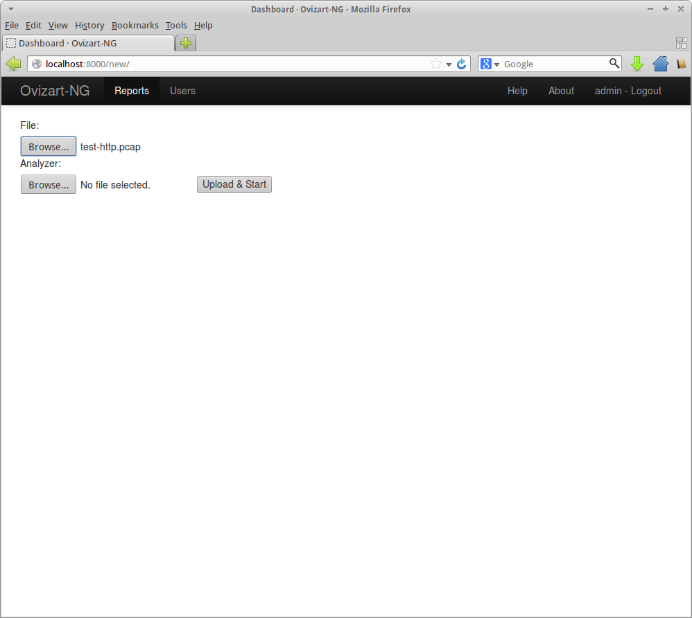

.. _usage:

**************
Usage Examples
**************

.. _ovizart-api:

Using Ovizart API
=================

.. _command-line-interface:

Using Commandline/Shell Interface
=================================

This feature is implemented by Hao MA. You can check following blog posts as example usages:

Interactive Shell Demonstration: http://gsoc2013.honeynet.org/2013/09/03/network-analyzer-project-updates-hao-ma-week-11-interactive-shell-demonstration/

Usage Examples for Shell/CLI: http://gsoc2013.honeynet.org/2013/09/10/network-analyzer-project-updates-hao-ma-week-12-testing-report/

CLI Demonstration: http://gsoc2013.honeynet.org/2013/08/27/network-analyzer-project-updates-hao-ma-week-10-cli-demonstration/

CLI Description: http://gsoc2013.honeynet.org/2013/07/23/474/

.. _web-ui:

Using Web UI
============

In this post I'll introduce our simple Web UI prototype.

Before we open the browser we need to start 2 different scripts under ovizart-ng/bin/ directory. First one is the daemon service, which is a basically a small REST API providing HTTP  Server. To start;::

  ./api_server.py start</pre>

This command will start a https server on localhost:9009 in order to change this values you can use this syntax::

  api_server.py [-h] [--host HOST] [--port PORT] [--ssl] {start,stop,restart}

Second command is responsible for  starting Web UI, which is based on Django 1.5. To start;::

  ./ui_server.py

this command will start Web UI on localhost:8000. Now we are ready; open a browser and on address bar write http://localhost:8000/

This screen will show up for login and daemon settings. Before we move on, Daemon Options will be moved to a configuration file,
for the ease of development and debugging I put those fields on the login form. These options should match with daemon parameters,
for default parameters user do not need to change anything.

In order to login, a user must be created with create_user.py script under directory ./ovizart-ng/bin/. In our example the user and
password is admin. This is not a default user account. Actually, system has no default users, one must be created right after installation.

.. figure:: _static/webui/WebUI-1.png
            :width: 625px
            :height: 441px
            :alt: Login Page

After login, (because of the first login) system does not contain any analysis. In order to start one click on the 'New' button on the left corner.

.. figure:: _static/webui/WebUI-2.png
            :width: 625px
            :height: 441px
            :alt: Empty Analysis Listing

This screen needs some makeup, but it has some nice feature. For example besides uploading your pcap file you can upload your analyzers as well.
so that you don't need to have an account on the core machine to use your own analyzer. I'm well aware that this feature could be very dangerous.
I'm planing to take 2 measures in order to improve security. First, improving user management by adding roles and rights, so that only certain users
will have right to upload analyzers. Second one is sand-boxing. Running analyzer module in a sandbox will make this feature a little bit safer.

Select your pcap file to upload and click on 'Upload & Start' button. Your next screen will be this one

.. figure:: _static/webui/WebUI-4.png
            :width: 625px
            :height: 441px
            :alt: Analysis Listing - Init

After some time (system does not have a progressbar to show the current status of the evaluation), click on the 'Browse' button or refresh the page
to see changed status of the analysis. If you want to delete an analysis click on the checkbox on the left side of the analysis and click on the
'Delete' button. This action can not be done, will delete each information, files, reports, etc. generated during that analysis.

.. figure:: _static/webui/WebUI-5.png
            :width: 625px
            :height: 441px
            :alt: Analysis Listing - Finished

Finished analyses have a summary on the rightmost column, number of packet, name of the pcap file and number of streams extracted from given pcap file. Clicking on ID will open the details screen.

.. figure:: _static/webui/WebUI-8.png
            :width: 625px
            :height: 441px
            :alt: Show Details - No attachments

At the top part we have the summary section which contains basic information about the given pcap file. The next section
contains the information about the streams extracted from given pcap file. Stream list is a collapsible table. Each row
of this table starts Application/Transport Layer protocol information. Then we have standard stream identifiers Source IP,
Source Port, Destination IP, Destination Port. Number of Packets follows the identifiers.

On rightmost column we can observe an icon of file and magnifier. File means that system extracted some file(s) from
that specific stream. Magnifier means that system has analyzer reports for that specific stream's extracted files.

.. figure:: _static/webui/WebUI-6.png
            :width: 625px
            :height: 441px
            :alt: Show Details - Attachments

Clicking on a row will expand that row and show additional info about that stream.

* **Pcap File**: clicking on the filename will start download of that stream specific pcap file.
* **Reassembled Traffic**: Those links provide reconstructed application layer traffic in a file for further analysis/study/examination. You can see 3 different links, clicking on links will start the download of files, that are

  A  -> B, this file contains all requests made by A

  A <-  B, this file contains all responses given by B

  A <-> B, this file contains whole request response pair between A and B.

* **Attachments**: This section contains information about extracted files from that stream. On the right column you can see the mime-type of the extracted file as well. Clicking on the link will start the download of extracted file.
* **Analyzer Reports**: Current system does have Virus Total and Cuckoo wrappers as analyzers. Clicking on those links will open a new tab for the results to see. Because of the limitations analyze results may take some time to be ready. Here is a sample screen-shot from virustotal.

.. figure:: _static/webui/WebUI-7.png
            :width: 625px
            :height: 441px
            :alt: Show Details - Attachments
